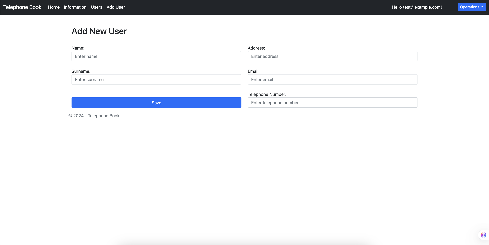
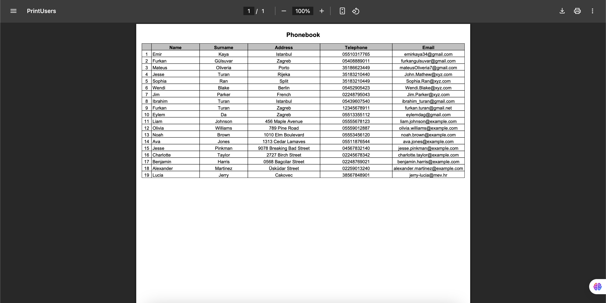

# Telephone Directory Application

This project is a modern web-based phone directory application. Developed using ASP.NET Core, it offers a user-friendly interface and powerful management features.

## Features

### 1. User Management

- Secure login system
- User addition and editing
- User list viewing and management

### 2. Main Page Features

- General information dashboard
- Easy navigation menu

### 3. File Operations

- Print user list to PDF

## Screenshots

### Login Page

### Main Page

### Information Page

### User List

### Add User

### File Operations

### Print Users

## Technical Details

- Framework: ASP.NET Core
- Database: MySQL (app.db)
- Architecture: MVC (Model-View-Controller)
- Folder Structure:
  - Controllers/: Application controllers
  - Models/: Data models
  - Views/: View files
  - Data/: Database operations
  - wwwroot/: Static files
